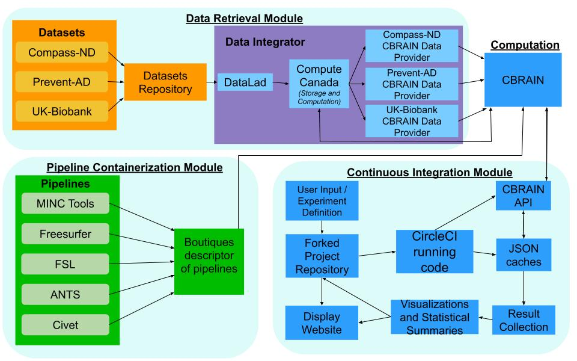

# NDR-CI

## Neuroimaging Dynamic Recomputation - Continuous Integration

### Use Python 3.7 or later

## Overview
**Goal:** To build a generic CI framework for the evaluation of neuroimaging results, which iteratively evaluates and updates results as new data, pipelines, or processing conditions become available. It allows users to systematically evaluate the variability and robustness of results within their neuroscience domain, and facilitate reproducibility.
It currently relies on the CBRAIN distributed computation framework.
It is work in progress :)

## Description and Diagram
* An ‘experiment definition’ yaml file allows the user to specify the pipelines, parameters, and datasets needed to describe and run their computational experiment. It will perform a multiverse-style analysis, where all of the specified pipelines and configurations are run on all the specified datasets. We can therefore determine if the results obtained are robust across pipelines and replicable across datasets.
* Each time the experiment definition is changed, a run in the CircleCI CI platform will be triggered, dynamically launching the required data processing, collecting the results, and transparently committing them along with statistical summaries and visualizations to the experiment CI workflow. 
* It makes use of existing open-source tools: the Datalad framework will reference datasets indexed in the CONP (Canadian Open Neuroscience Platform) repositories, which are transferred to Compute Canada. Here, the data can be accessed by CBRAIN, a neuroimaging distributed cloud computing platform able to handle computationally intensive research and that features an API, allowing computations to be executed from within CircleCI. 
* Pipelines will point to the Boutiques tool descriptor, which allows them to be containerized and run on CBRAIN/NeuroHub.
* The initial pipelines and datasets that are being integrated can be seen in the diagram below. They have been chosen as they are pertinent to my research question on the associations of hearing loss and brain structure.

## Required Accounts:

* [GitHub account](https://github.com/)
* [CBRAIN account](https://portal.cbrain.mcgill.ca/login)
* [CircleCI account](https://circleci.com/)

## How to run this platform
*Note that the structure of many of the following files I mention can easily be learnt by looking at the files and how I currently have them setup.*

* (1) Create the required accounts to run this platform.

* (2) Fork this repository.

* (3) Edit the Experiment Definition yaml file to add the pipelines and datasets, make sure the pipeline components are in the correct order. 
Add the relevant CBRAIN IDs for tools and data providers in the  Config_Files/CBRAIN_IDs.yaml file, and add the task parameter json files to the Task_Parameters directory. Provide the path to the parameters for each component in the Experiment Definition. Note that the names by which you refer to the pipelines and datasets have to be written identically in the config file and the Experiment Definition.

* (5) Edit the analysesVisualizations.py module to process your results from the cache files and produce the plots as you see fit.

* (6) In CircleCI, and create a new pipeline for your forked repo.

* (7) Modify the environment variables in CircleCI. Add your CBRAIN credentials as 'cbrain_user' and 'cbrain_password'. Generate a CircleCI token and add is as 'CCI_token' (to be able to download the latest cache file from the artifacts). You will also need to add your GitHub deploy key to the project's SSH Keys in CircleCI.

* (8) Modify the circleCI config file in .circleci/config.yml. Make sure the cron-job is running at the desired frequency, and make sure all of your outputs (By default I have this setup as all json cache files and the plots) are deposited in the 'artifacts' directory which is created in this file.

## File and data layout and descriptions

The main directories in the repository are:

* **Config_Files:** Contains configuration files. Currently only contains the CBRAIN_IDs.yaml file (see below).

* **Related_Files:** Miscellaneous bits and bobs I have made over the course of the project which make life easier, such as a script to register files in CBRAIN, a bash script to help creating a flat directory of .nii.gz files from datasets, etc.

* **Task_Parameters:** Has a json file specifying the parameters for each pipeline component as a dictionary. I recommend exploring the tools on CBRAIN, copying their parameter dictionary for posting a task, and pasting it into a json file in this directory to ensure the API calls are made properly.

* **Tests:** Contains the unit tests for the code. Still very much a work in progress.

Some important files to start with are:

* **Experiment_Definition.yaml:** The user specifies the names of the datasets, pipeline. They specify pipeline components in the order they will execute in, as well as the paths for the parameters of each component. Note that the names provided in this file must match the names in Config_Files. 
This is the main file the user is meant to modify to define the computational experiments being run.

* **.circleci/config.yml**: Downloads and installs the necessary packages for Python. Launches the NeuroCI.py script using CircleCI environment variables to pass it arguments. It creates an artifacts directory which will contain all of the CircleCI artifacts available (our desired output). It copies the json cache files to this directory. 
It also has a section to specify a cron-job to routinely update your caches and computations.

* **Config_Files/CBRAIN_IDs.yaml:** Allows the user to specify the CBRAIN data provider ID for the datasets (points CBRAIN to your dataset on Compute Canada) and the pipeline component IDs ("Tool_config_IDs" on CBRAIN). These are the IDs the script will use to access the data and pipelines in CBRAIN. Note that the names provided in this file must match the names in the Experiment Definition.

* A json cache file with the name of each dataset will automatically be produced, and keeps track of all the CBRAIN IDs of files and tasks, computation statuses, and the results of the current CI run. It is then exported as an artifact to be downloaded at the beginning of the next CI run. The first level of a json cache file are all the filenames in the dataset's CBRAIN data provider, and then under the file the separate pipelines (and then pipeline components and results) are present with their relevant information.

The main Python modules are:

* **NeuroCI.py:** The "main" central module which orchestrates the workflow. It logs the user on to CBRAIN, obtains the circleCI token, and the url to download the newest artifacts from the last run (all stored in the CircleCI environment variables, and passed to the script in the CircleCI config file). It then reads the Experiment Definition and the config file, and passes all relevant info to the "main" function.
The main function is a simple nested loop. The outer loop iterates over the datasets in the experiment definition, downloads the latest cache file  (json file which keeps track of intermediate computations and completed computation results from CBRAIN for a single dataset) from the previous circleCI run, and queries CBRAIN in order to update all of the task statuses. 
The inner loop iterates over the pipelines in the experiment definition file. It adds any new files available in the data provider to the cache, and calls the pipeline manager to deal with the posting of tasks for each component of the current pipeline and dataset.

* **cacheOps.py:** Contains any and all functions that in some way, shape, or form perform operations on the dataset cache files. These range from downloading the latest cache file, to generating a new cache file from scratch, generating new subjects, to updating task and result statuses in a cache file, etc.
One function that is important to highlight is the pipeline manager, which iterates over each component in a pipeline, organizes, and feeds the necessary data to the functions which post tasks on CBRAIN and update the caches with the newest progress in computations.

* **cbrainAPI.py:** Contains all of the API calls used to communicate with CBRAIN. Each API call has it's own function.

* **analysesVisualizations.py:** This is run as a separate script from NeuroCI.py in the CircleCI config file. It iterates through the results from the cache files, processing them however the user desires, and plots them. It downloads further files from CBRAIN (such as sensitive data we don't wish to make public in the repo) loops through all the pipelines in the Experiment Definition, and launches a function to process a dataset cache file (this function will vary depending on the users experiment).
For example, for Prevent-AD, this function iterates through the cache, matches the results from finished computations to the corresponding measures from the file we just downloaded earlier in the script, and then plots a correlation which we can output along with the cache file as artifacts in CircleCI (the plot is saved directly to the artifacts directory - see the **.circleci/config.yml** heading above). Thus the user has access to the most up-to-date results and graphics. Currently in very early stages.

## Function descriptions

While I may indeed someday make an entire written document for each individual function, for now I recommend parsing through the code and seeing the comments and docstrings in it to understand it. I've spent some time trying to make the code and commenting informative and modular.

## Quick fixes

* If code crashes or CBRAIN fails before the cache json file is produced, then the "previous' ' cache doesn't exist in the CI, and the next build starts computations again from scratch (or in the case of a cbrain download failure, it just populates the cache with '1'). This is remedied by changing the circleCI config file from '$latest' to the number of the last successful run, running it, and then changing it back to '$latest' when it has finished. Working on a less hacky fix for this soon :)
